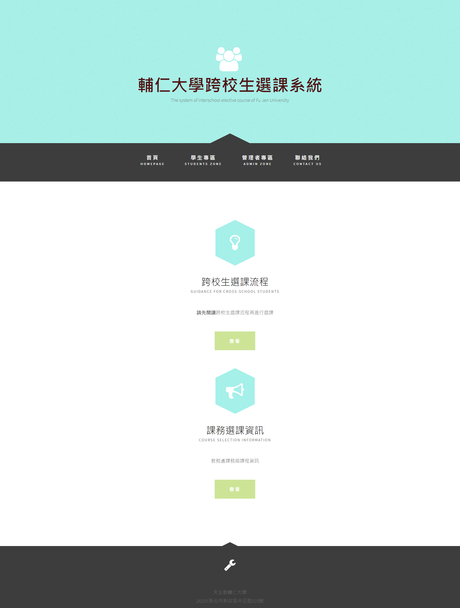
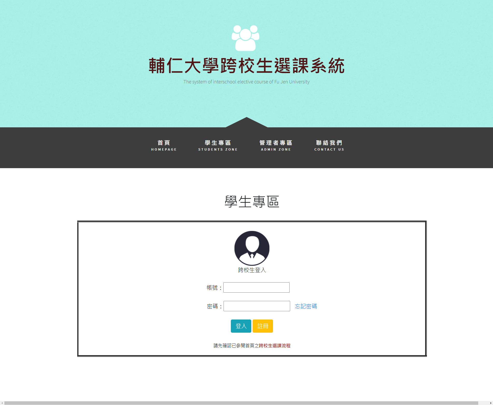
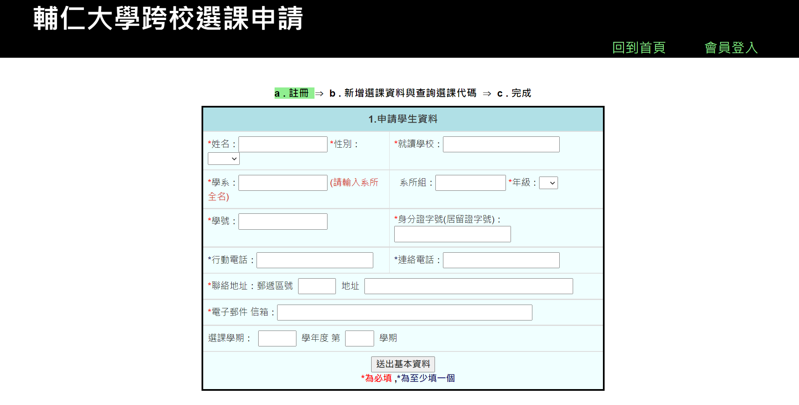
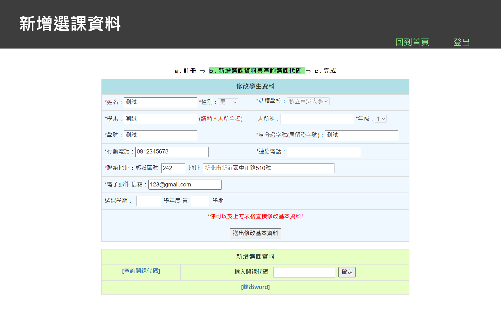
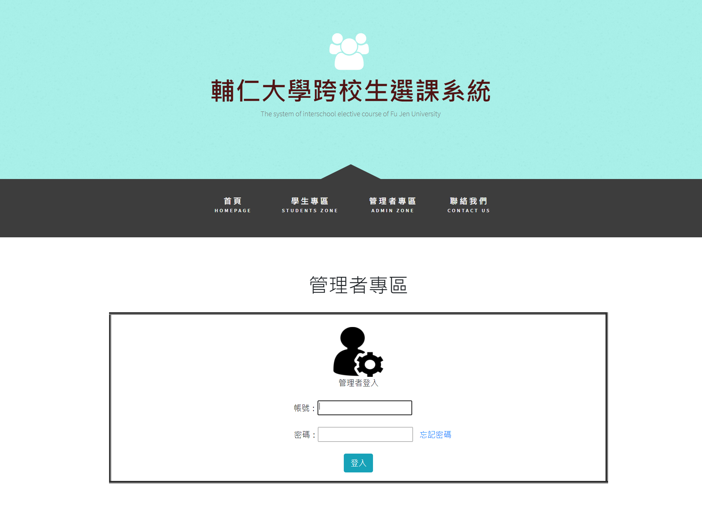
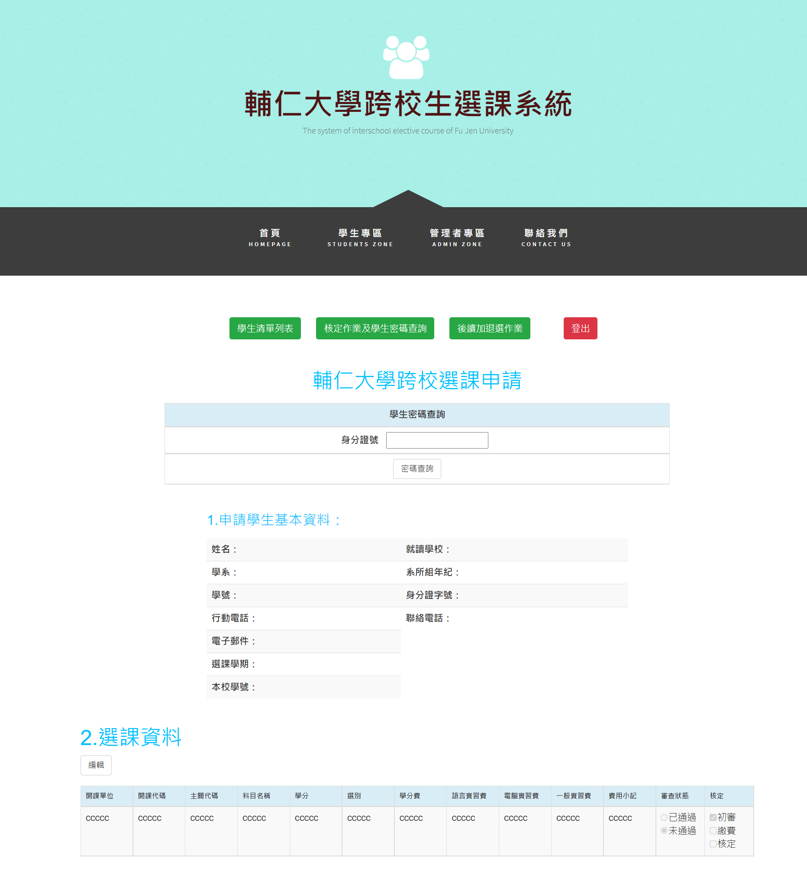

# 跨校生選課系統 Cross Course Application System

該專案主要為因應學生有 **跨校選課** 之需求所設計，為大一網頁前端課程時運用HTML、CSS所撰寫

使用者主要分為學生與審核人員兩個部分

## 功能

學生

* 登入/註冊
* 選課
* 查詢

審核人員

* 登入/註冊
* 名單統計
* 審核
* 加退選資料

## 介面

* 首頁

頁面呈現為上方一排選單，中間單獨使用iFrame進行頁面的切換，故網頁整體外觀不會更動

----

### 學生

學生可以先選擇先註冊帳戶或直接登入帳戶，進入後可以依開課單位所釋放之課程進行選課，選課完成後再交由審核人員進行覆核

* 學生登入頁面

* 學生註冊頁面

* 學生選課頁面

----

### 審核人員

管理者會透過專屬帳戶進行登入，便可以查看目前學生資訊、選課情況以及審核學生選課申請

* 審核人員登入頁面

* 審核人員審核頁面

